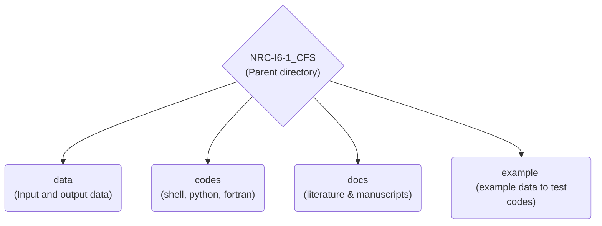

# CFS_Calculation
This Repo contains package for CFS calculation and ROC analysis as published in  https://doi.org/10.1029/2020JB019553

# [Is Coulomb stress the best choice for aftershock forecasting?](https://doi.org/10.1029/2020JB019553)

This is an archive of the NRC project I6 part 1

**Author:** Shubham Sharma  
**Supervisors:** Sebastian hainzl, Gert Zöller and Matthias Holschneider

## <span style="color:#3386ff">Archive structure</span>



## <span style="color:#3386ff">Directory structure</span>

```
NRC-I6-1_CFS
|   README.md
|
|___data
|   |___workingData
|   |   catalog.dat
|   |   events.txt
|   |
|   |   |___srcmod
|
|___example
|   |___figs
|   |   |___stress
|   |   |___ROC
|   |
|   |___workingData
|   |   catalog.dat
|   |   events.txt
|   |
|   |   |___PSCMP-INPUTFILES
|   |   |   |___okada
|   |   |   |___GF
|   |   |
|   |   |___PSGRN-INPUTFILES
|   |   |___psgrn+pscmp_out
|   |   |   |___pscmp_out
|   |   |   |   |___okada
|   |   |   |   |___GF
|   |   |   |
|   |   |   |___psgrn_out
|   |   |   |
|   |   |   |___tmp_out
|   |   |___srcmod
|   |   |___interData
|   |   |   |___ASFiles
|   |   |   |___polys
|   |   |
|   |   |___ROCData
|   |   |   |___ROCout
|   |   |   |   |___MAS0
|   |   |   |   |___MAS
|   |   |   |   |___OOP
|   |   |   |   |___VM
|   |   |   |   |___MS
|   |   |   |   |___VMS
|   |   |
|   |   |___stressData
|   |   |   |___MAS0
|   |   |   |___MAS
|   |   |   |___OOP
|   |   |   |___VM
|   |   |   |___MS
|   |   |   |___VMS
|   |
|___codes
|   |___packages
|   |   |___PSGRN+PSCMP
|   |   |___CRUST_2.0
|   |
|   |___1_preProcessing
|   |___2_genStressTensors
|   |___3_ROCAnalysis
|   |___4_plotting
|
|___docs
|   Sharma_IS-CFS-best-choice_2020_JGR-Solid-Earth.pdf
```

## <span style="color:#3386ff">Directory contents</span>

**NRC-I6-1_CFS:** Parent directory

* **rawData:** Directory to store ISC Catalog in pickle format, which can be downloaded from ISC website.

* **data:** contains all (raw and processed) data  [This is where real work can be done]    
|---**workingData:** contains pre-processed data and results  

* **example:** an example folder where all the codes can be tested  
|---**workingData:** contains pre-processed data and results  

* **codes:** contains all codes related to this work  
|---**packages:** external packages used  
|---**1_preProcessing:** all pre-processing code for CFS calculation using PSGRN+PSCMP   
|---**2_genStressTensors** a shell script to run PSGRN+PSCMP codes  
|---**3_ROCAnalysis** ROC analysis scripts to calculate ROC values  
|---**4_plotting** Plotting scripts to plot stress maps and ROC curves

* **docs:** Publications and related material

## <span style="color:#3386ff">Working steps</span>

## NOTE:
Please create the directories mentioned in directory tree [`example`] before proceeding for calculations. 

1. ### Pre-processing
    * scripts used: 
        * `fsp2PSGRN.py ` [Prepare SRCMOD files to be used as input in PSGRN]
        * `fsp2PSCMP.py ` [Prepare SRCMOD files (okada or GF) to be used as input in PSCMP]

    * inputs:
        * `catalog.dat and SRCMOD .fsp files`

    * Working steps:
        * goto directory `example` and run 
    ```
    python ../codes/1_preProcessing/fsp2PSGRN.py
    python ../codes/1_preProcessing/fsp2PSCMP.py
    ```
    * output:
        * output would be saved in `workingData/PSGRN-INPUTFILES` and `workingData/PSCMP-INPUTFILES/[okada/GF]`

2. ### Stress tensors and CFS using PSCMP+PSGRN program
    * scripts used:
        * `run_PSGRN+PSCMP.sh` [Generate stress tensors using Rongjiang's PSGRN+PSCMP codes]
    
    * inputs:
        * Inputs for running PSGRN are saved in `PSGRN-INPUTFILES`
        * Inputs for running PSCMP are saved in `PSCMP-INPUTFILES/[okada/GF]`

    * working steps:
        * goto directory `example` and run

    ```
    ../codes/2_genStressTensors/run_PSGRN+PSCMP.sh
    ```

    * outputs:
        * outputs are saved in `workingData/psgrn+pscmp_out/`

3. ### ROC analysis  
    * Standard scripts for calculating ROC curves are given, in order to conduct tests regarding different grid-size, magnitude cut-off and aftershock duration modify parameters in scripts accordingly and produce results.
    * This script also save stress metric values for different stress in `workingData/stressOut` folder

    * scripts used:
        * `calcROC.py` [Generate ROC values as well as save stress metric]

    * inputs:
        * stress files saved in `pscmp_out`
        * srcmod file saved in `srcmod`
        * event catalog file `events.txt`
        * aftershock catalog saved as binary `isc_rev.pkl`

    * working steps:
        * go to directory `example` and run
    
    ```
    python ../codes/3_ROCAnalysis/calcROC.py
    ```

    * outputs:
        * ROC values are saved in directory `ROCData/ROCout/` for all stress metric
        * stress metric values saved in `stressData/`

4. ### Plotting
    * standard scripts for plotting stress maps and ROC curves

    * scripts used:
        * `plotStress.py` [Plots stress maps for a slip model]
        * `plotROC.py` [Plots ROC curves for different user inputs]

    * inputs:
        * Stress files saved in `workingData/stressData`
        * ROC files saved in `ROCData/ROCout`

    * working steps:
        * go to directory `example` and run
    ```
    python ../codes/4_plotting/plotStress.py
    python ../codes/4_plotting/plotROC.py
    ```

    * outputs:
        * output figures (stress maps and ROC curves) are saved in `figs/[stress/ROC]` directory

#### For any help regarding the programs contact sharma@gfz-potsdam.de